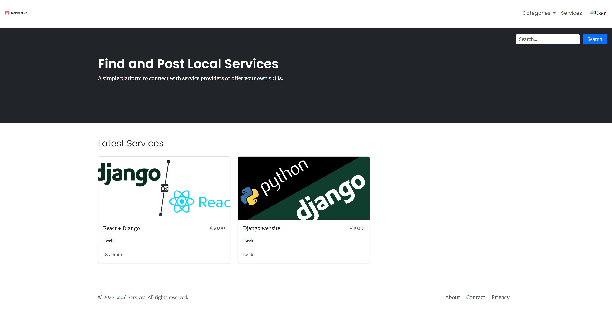

### ✅ `README.md`

```markdown
# 🎯 FreelanceHub

**FreelanceHub** is a freelance service marketplace built using Django. It allows users to browse, filter, and search freelance services by category. The platform is responsive, fast, and easy to navigate.
```





---

## 🚀 Features

- 🗂 Category-based service filtering
- ☁️ Cloudinary integration for image
- 🧩 Bootstrap 5 integrated for responsive design
- 🎨 Poppins font styling with hover animations
- 🖼 Custom logo for navbar,
- 🛠 Admin panel for service management

---

## 🛠 Tech Stack

- **Backend**: Django (Python)
- **Frontend**: HTML, CSS, Bootstrap 5
- **Database**: SQLite (default)
- **Static Management**: Django static files
- **Font**: Poppins (Google Fonts)


---

## ⚙️ Installation

1. **Clone the repository**
```bash
git clone https://github.com/your-username/freelancehub.git
cd freelancehub
````

2. **Set up a virtual environment**

```bash
python -m venv env
# On Windows:
env\Scripts\activate
# On Mac/Linux:
source env/bin/activate
```

3. **Install dependencies**

```bash
pip install -r requirements.txt
```

4. **Apply migrations**

```bash
python manage.py migrate
```

5. **Create a superuser (optional)**

```bash
python manage.py createsuperuser
```

6. **Run the development server**

```bash
python manage.py runserver
```

---

## 📁 Static Files

Collect static files before deployment or if needed locally:

```bash
python manage.py collectstatic
```

---

## 🪲 Known Bug Fixed

**🔧 Issue**: Categories dropdown in navbar appeared empty on some pages (like `/service_list/`).

**✅ Fix**: Created a global context processor to make `Service.CATEGORY_CHOICES` available on all templates.

### Fix Steps:

1. **Create** `services/context_processors.py`:

```python
from .models import Service

def category_choices(request):
    return {
        'categories': Service.CATEGORY_CHOICES
    }
```

2. **Update** `settings.py`:

```python
TEMPLATES = [
    {
        ...
        'OPTIONS': {
            'context_processors': [
                ...
                'services.context_processors.category_choices',
             'servicescontext_processors.category_choices',
            ],
        },
    },
]
```

**🔧 Issue**: In the mobile view, the dropdown menu in the navbar was causing excessive white space even when the menu was not expanded..

**Cause**:
By default, Bootstrap dropdown menus use position: absolute to overlay on top of content and avoid affecting layout.

**✅ Fix**:
Ensure the .dropdown-menu uses position: absolute so it doesn't take up space when hidden.


**🔧 Issue**: Navigation bar image was corrupted and not displaying after the project was deployed on render

**✅ Fix**:
Repalced image


**🔧 Issue**: The website was not displaying properly on smaller screen 

**Cause**:
The meta viewport was missing fron <head> on base tempalte

**✅ Fix**: 
```html 
Added
  <meta name="viewport" content="width=device-width, initial-scale=1">

```

## 🎨 Fonts & Styles


**Font Used**: [Poppins](https://fonts.google.com/specimen/Poppins)

To use in your templates:

```html
<link href="https://fonts.googleapis.com/css2?family=Poppins:wght@400;600&display=swap" rel="stylesheet">
<style>
  body {
    font-family: 'Poppins', sans-serif;
  }
</style>
```


---

## 📄 License


## 🌐 Contact

**Author**: David Cuevas Díaz
**Email**: [davicd08@gmail.com.com]


